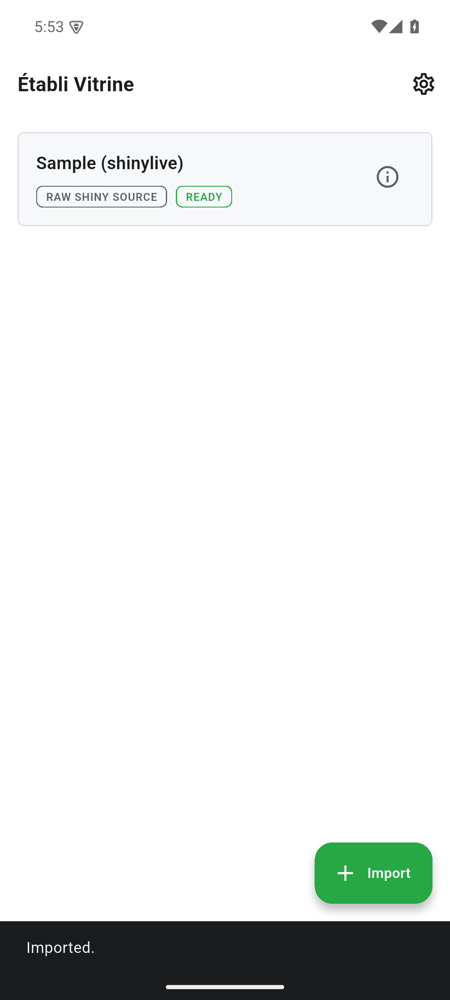

A guided, screenshot-by-screenshot walkthrough of Établi Vitrine v0.1.0 — the
display case that runs Shiny apps offline via shinylive + WebR. Every figure below
is a real screenshot of the v0.1.0 build on an Android device.

## The library

The library ("display case") lists the Shiny apps you've imported, each runnable
offline with one tap. On a fresh install it's empty and points you to **+ Import**.

{width=320}

## Importing a Shiny app

**+ Import** opens a sheet with four sources: **From device files** (a shinylive
`.zip`, or `app.R` / `ui.R` + `server.R`), **From URL** (download a `.zip`), and
two **bundled samples** — *Sample shinylive app* and *Sample raw R app*.

{width=320}

## Bundled samples

The two bundled samples — *Sample (shinylive)* and *Sample raw R app* — import in
one tap and run offline on the bundled shinylive/WebR engine. Pick either from the
import sheet and it lands in the library with a **READY** badge ("Imported."), ready
to launch with no network and no files to fetch.

{width=320}

The rendered Shiny UI needs the WebR engine to finish booting — a few seconds on a
real device — before the app draws. The figure above shows the sample imported and
READY in the library.

## Settings

Settings covers theme (light / dark / system) and runtime preferences.

{width=320}

## Runtime

| Component | Role |
|-----------|------|
| **WebR** | R runtime as WebAssembly. |
| **shinylive** | Shiny runtime, runnable in a WebView. |
| **Local HTTP server** | Serves assets with the COOP/COEP headers WebR needs for `SharedArrayBuffer`. |

## Offline guarantee

Apps run fully inside the local WebAssembly sandbox. The only outgoing request is
when you deliberately import an app from a URL.

## Where to get it

Android only for now — a **development build (signed APK)** via
[GitHub Releases](https://github.com/etabli-dev/etabli-vitrine/releases/tag/v0.1.0).
App Store, Google Play and F-Droid are planned but not yet available.
