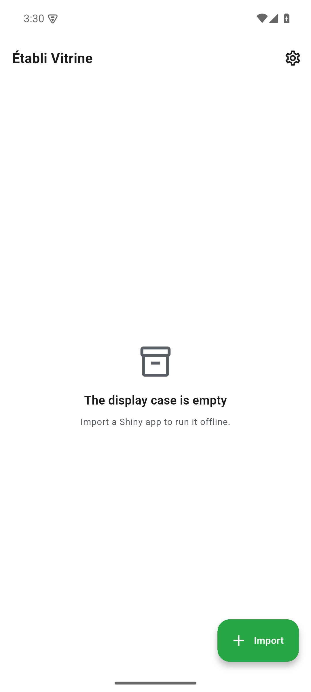

# Vitrine — Vignette & Tutorial (v0.1.0)

> **Établi Vitrine** runs interactive **Shiny** apps offline, on the device — via
> shinylive + WebR, with no server. Import a shinylive bundle (or raw `app.R` /
> `ui.R` + `server.R`), and it stages and runs entirely locally. The suite's
> statistical power-analysis ships as a Shiny app for Vitrine rather than as a
> standalone app.
>
> **Stack:** Flutter (Dart), bundled `shinylive-r` + WebR WASM. Part of the
> **établi** suite. Figures are real screenshots of the v0.1.0 build on an Android
> emulator, regenerated by `scripts/capture.sh`.

## Table of contents
1. [Quick start](#quick-start)
2. [The library](#feature-the-library)
3. [Importing a Shiny app](#feature-importing-a-shiny-app)
4. [Settings](#feature-settings)
5. [Reproducing these figures](#reproducing-these-figures)
6. [Known gaps](#known-gaps)
7. [Version](#version)

## Quick start
Install `vitrine-0.1.0.apk` and open it. The library ("display case") starts
empty; the **+ Import** action brings in a Shiny app to run offline.


## Feature: The library
The library lists the Shiny apps you've imported, each runnable offline with one
tap. When empty it prompts you to import one.


## Feature: Importing a Shiny app
**+ Import** opens a sheet with four sources: **From device files** (a shinylive
`.zip`, or `app.R` / `ui.R` + `server.R`), **From URL** (download a `.zip`), and
two **bundled samples** — *Sample shinylive app* (runs offline) and *Sample raw R
app* (raw `app.R` staged + run via WebR).


## Feature: Settings
**Settings** covers theme (light / dark / system) and runtime preferences.



## Reproducing these figures
```bash
flutter pub get
flutter build apk --debug
adb install -r build/app/outputs/flutter-apk/app-debug.apk
bash scripts/capture.sh
```
Device: 1080×2400 @ 420dpi, animations disabled.

## Known gaps
- **Bundled sample assets missing (capstone §2.5).** The import sheet *surfaces*
  the bundled samples and the import code references
  `assets/samples/shinylive-sample.zip`, but in v0.1.0 `assets/samples/` ships only
  a `.gitkeep` — the sample bundle is absent, so importing it fails gracefully with
  *"Unable to load asset … does not exist or has empty data."* (no crash):

  

  The §2.5 requirement (a runnable bundled Shiny app the vignette is built from) is
  therefore **not met** in v0.1.0. The fix is content, not code: add a real
  shinylive `.zip` (and a raw `app.R`) under `assets/samples/`. Captured honestly
  rather than faked; planned for a follow-up. (A real Shiny app still runs fine if
  imported **From device files / URL**.)

## Version
Documents établi **Vitrine v0.1.0** (applicationId `com.raban.etabli.vitrine`).
Part of the établi (workbench) suite.
